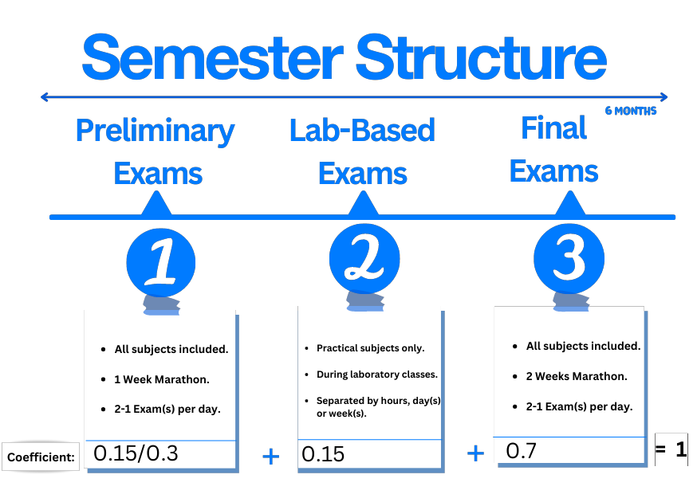

 

# Motivation

*Welcome* to the guide for computer engineering bachelor's students aspiring to build a successful career in the field of Information Technology.

**Is this the perfect fit for you?**

- **Future-proof your career:** Embrace a field with consistently growing demand for IT professionals like yourself.
- **Adaptable skill set:** Develop a versatile skill repertoire that enables you to navigate seamlessly through evolving technologies.
- **Lucrative earning potential:** Capitalize on the increasing investment companies are making in top-tier talent like you. 

Your skills are not just in demand; they are a valuable asset in the competitive landscape of the future.

The power is now in your hands. 
🎯 Let's jump on this exciting journey together and discover the fascinating world of IT and tomorrows!

# Empowering Students
This guide aims to complement your degree by introducing you to a range of remarkable innovations that the world is constantly leveraging to provide value incl.  web, mobile development, computer architecture, security, and cloud computing.

**TL;DR** The content presented does not carry any official affiliation or rights from the designated institution. 
Instead, it represents a collaborative endeavor by 2 individuals committed to delivering information, resources and help you level up — Why? Because why not!

# Path to options
In terms of your degree, you have 5 semesters total. After 2 semesters, the student should be able to select one of two specialties for the remaining three semesters. 

This will enable the pursuer to concentrate their studies on a specific area and gain more knowledge in that domain.
- IOT & Embedded systems (IOT)
- Network and Systems Engineering (IRS)

> ISTIC used to assign students with higher grades to IOT; This could imply that IOT is the best option. It is not. Both paths are excellent.

# Examining methodology
The asset below depicts the proctoring methodology used for each semester.
- **1:** A written exam on all of the subjects covered.
- **2:** Hands-on exams for specific subjects that necessitate the use of software.
- **3:** Final exams, which play the most important role in the semester's success.

# Professional Experience: Internship
Students are required to have at least **two** **internships**. 

| 𝑛 | Mandatory Internship           |Term   |
|-- |----------------------          |:-----: |
| ❶ | Project End of the Year        | PFA    |
| ❷ | Project End of Study           | PFE    | 

 

Internships provide students with the opportunity to gain experience in their field of interest and to develop professional skills. 

# Get Started

Each section will include usefull resources and content to assist you in excelling in your preparation and making the most of your education.
##### The guide is structured as follows.

| Mutual      | IOT |Net  | Projects|   
| -----------: | :-----------: |:-----------: |:----------- |
| [Ⅰ](Semester1/1.md )|[Ⅲ](Semester3-IOT/3.md)| [Ⅲ](Semester3-IRS/3.md)|[Linuxmap](https://linux.computer-engineering.tech/)|
| [Ⅱ](Semester2/2.md)        |[Ⅳ](Semester4-IOT/4.md)| [Ⅳ](Semester4-IRS/4.md) | [OpenLabs](https://labs.computer-engineering.tech/)|
| [Interns](intern.md)       |[Ⅴ](Semester5-IOT/5.md)| [Ⅴ](Semester5-IRS/5.md) | [StaledVer](https://stale.computer-engineering.tech/#/)|

## Students FAQ

1. What is an end-of-year project (PFA)?

An end-of-year project also PFA is a comprehensive academic project that students complete at the end of a given year while pursuing a degree program 

E.g. at the end of your 1st or 2nd college year during a <a href="#/intern">Summer Internship</a>.

2. What is an end-of-study project (PFE)?

An end-of-study project also PFE is a comprehensive academic project that students complete at the very end of their degree program.

3. Is the internship paid or unpaid?

Internships can be paid, unpaid, or offer a stipend. Paid internships are more common in certain industries, but the experience gained from an unpaid internship is valuable. 

My internship at <a href="https://raw.githubusercontent.com/yaya2devops/bachelor-guide/main/docs/images/InternsAssets/attes.png">Linedata</a> was unpaid but got my takeoff to the sky.

4. What can I expect during my internship?

Internship experiences vary, but you can expect to work on tasks related to your field, collaborate with colleagues, attend meetings, and learn from professionals in the industry.

5. No internship. No idea what topic to go for.. I give up?

Having people around can be nice, BUT it is not an absolute necessity.  
You possess the potential to chart your own course, and others will take notice in due time.

Meaning. Start to work on your LaTeX report immediately.  
I have supplied you with all the resources and information I once hoped to find, which should enable you to successfully complete the job.

Come <a href="#/control">Join me</a> more where I guide you to the next level.

6. How many pages You suggest I do for my report?

I highly recommend doing a 30 "plus" pages for your PFA. So you can aim and feel comfortable for 60 plus on your PFE.

7. Good! What about the languages for report and presenation?

You have the flexibility to choose a language for both tasks. This means you can, for instance, select French for your report and French for your presentation, or opt for English for both your report and presentation.

8. Will this website stay live and I can access it whenever I need?

Certainly, I've already <a href="#/renewal/">renewed the domain here</a>, and I'll continue to do so consistently to ensure you can learn anytime, anywhere. Promise!

9. This is not a question, but I feel so ready for this. Thanks a lot.

 
Pleasure. I love that!

So! It's time to demonstrate your commitment and make the most out of this experience.
 

Create, Build, Adjust, and deliver! 
 
I'll sense your energy flowing from the universe! 

10.  Bonus! Ask Us anything.

If you require any more help for your studies  

<a href="https://github.com/yaya2devops/bachelor-guide/issues/new?title=Let%20Us%20Know&body=%0A%0A%5BYaya%20Ask%20For%20Your%20feedback%20here%5D%0A%0A%0A---%0A%23%23%23%23%20Guide%20Details%0A%E2%9A%A0%20*Leave%20This%20section%20for%20GitHub%20and%20Guide%20issue%20redirections*%0A*%20ID%3A%20%5B7e2c0e6e-8b6d-4c2f-aaef-15f736a7b2a1%5D%0A*%20Version%20Independent%20ID%3A%20%5Ba5f1d387-7be9-4f0c-b92d-d52d16ef1d8e%5D%0A*%20Content%3A%20%5BBachelors%20in%20Computer%20Engineering%20Guide%5D%0A*%20Content%20Source%3A%20%5Bbachelor-guide/docs/README.md%5D(https://github.com/yaya2devops/bachelor-guide/blob/main/docs/README.md)%0A*%20Service%3A%20%5Bcollege-students-empower%5D%0A*%20GitHub%20Handle%3A%20%40yaya2devops"><b>Raise an issue</b></a>.  

You have to create an account to fetch your data. We will get back to you ASAP.

---

